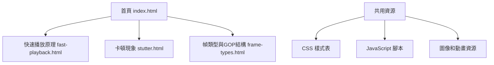
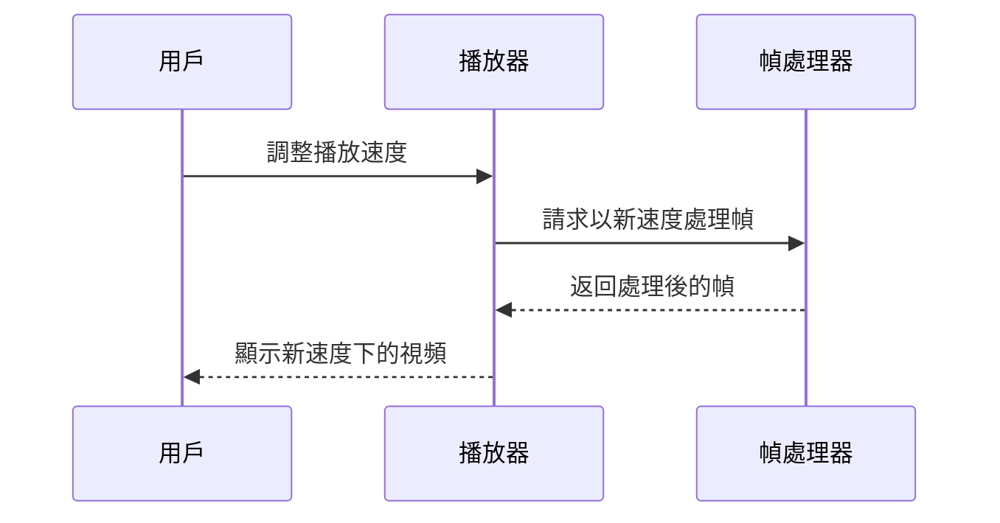
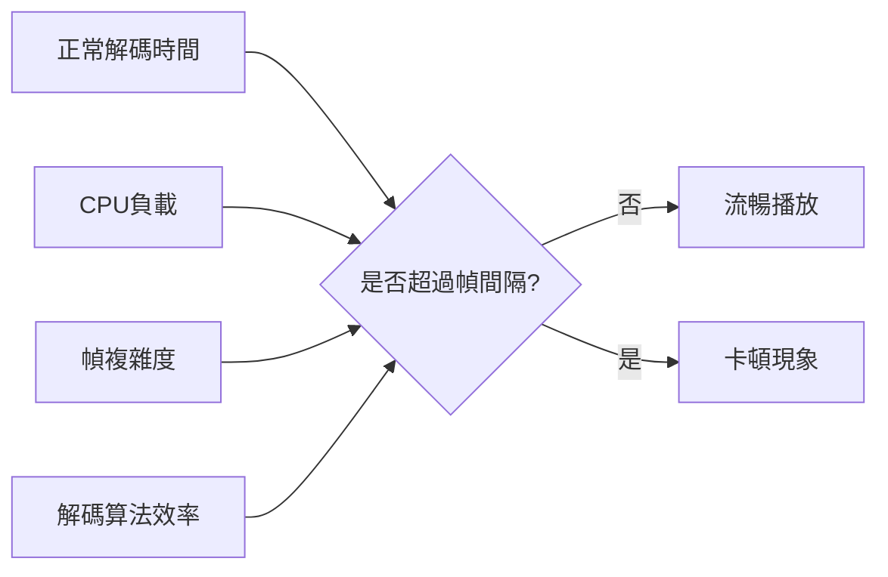
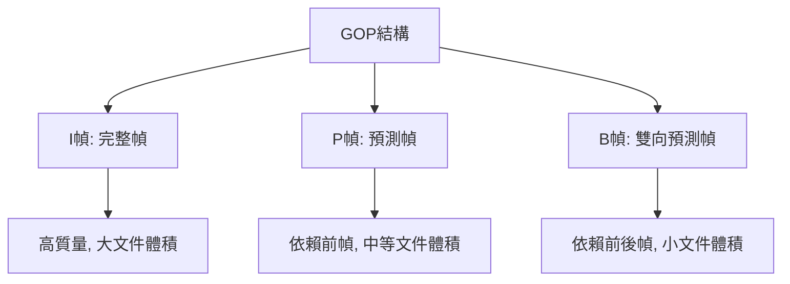

# 視頻編碼教育網站實施計劃

## 1. 網站結構



## 2. 技術架構

- **前端技術**：純HTML5、CSS3和JavaScript
- **互動元素**：使用Canvas和JavaScript實現動畫和互動效果
- **響應式設計**：確保在不同設備上都有良好的顯示效果

## 3. 頁面設計與內容

### 3.1 首頁 (index.html)

- **設計風格**：現代簡約，清晰的導航
- **內容**：
  - 簡短的網站介紹
  - 三個主要部分的卡片式導航，每個卡片包含主題簡介和相關圖示
  - 頁腳包含基本信息

### 3.2 快速播放原理頁面 (fast-playback.html)

- **內容結構**：
  - 理論解釋：視頻播放速度的基本原理
  - 技術挑戰：加速播放時面臨的問題
  - 解決方案：常見的處理方法
- **互動元素**：
  - 可調節速度的視頻播放演示
  - 動畫展示不同播放速度下幀的處理方式



### 3.3 卡頓現象頁面 (stutter.html)

- **內容結構**：
  - 卡頓現象的定義和表現
  - 技術原因：為什麼會發生卡頓
  - 影響因素：哪些因素會加劇卡頓
- **互動元素**：
  - 模擬展示正常播放與卡頓播放的對比
  - 互動圖表顯示不同因素對卡頓的影響



### 3.4 幀類型與GOP結構頁面 (frame-types.html)

- **內容結構**：
  - 不同幀類型的介紹（I幀、P幀、B幀）
  - GOP結構的解釋和重要性
  - 幀類型對壓縮和播放的影響
- **互動元素**：
  - 互動式GOP結構展示
  - 動畫演示不同幀類型的編碼和解碼過程



## 4. 互動元素詳細設計

### 4.1 播放速度與幀關係演示

- **功能**：用戶可以調整播放速度滑塊，觀察不同速度下幀的處理方式
- **技術實現**：使用Canvas繪製幀序列，JavaScript控制動畫速度和幀選擇邏輯
- **視覺效果**：顯示原始幀序列和實際播放的幀，突出顯示被跳過的幀

### 4.2 GOP結構互動展示

- **功能**：用戶可以點擊不同類型的幀，查看其依賴關係和壓縮原理
- **技術實現**：使用SVG或Canvas繪製GOP結構，JavaScript處理交互邏輯
- **視覺效果**：使用不同顏色區分幀類型，動態顯示幀間依賴關係

### 4.3 卡頓現象模擬器

- **功能**：模擬不同條件下的視頻播放，展示卡頓現象的產生和影響
- **技術實現**：JavaScript控制幀的顯示時間，模擬解碼延遲
- **視覺效果**：並排顯示流暢播放和卡頓播放的對比，提供參數調整選項

## 5. 資源需求

### 5.1 圖像資源

- 各類幀的示例圖像
- GOP結構示意圖
- 播放速度和卡頓現象的視覺化圖表

### 5.2 代碼資源

- 基本HTML結構
- CSS樣式表（現代簡約風格）
- JavaScript交互腳本
- 動畫實現代碼

### 5.3 參考資料

- 視頻編碼基本原理
- 常見視頻格式的GOP結構
- 播放速度算法相關資料

## 6. 實施時間線

1. **準備階段**（1-2天）
   - 創建基本文件結構
   - 設計CSS樣式框架
   - 收集必要的圖像和參考資料

2. **開發階段**（3-5天）
   - 實現基本HTML結構和導航
   - 開發各頁面的靜態內容
   - 實現互動元素和動畫

3. **測試與優化**（1-2天）
   - 測試所有互動功能
   - 優化響應式設計
   - 確保跨瀏覽器兼容性

## 7. 文件結構

```
encoding-tutorial/
├── index.html                 # 首頁
├── pages/                     # 內容頁面
│   ├── fast-playback.html     # 快速播放原理
│   ├── stutter.html           # 卡頓現象
│   └── frame-types.html       # 幀類型與GOP結構
├── css/                       # 樣式表
│   ├── style.css              # 主樣式表
│   └── animations.css         # 動畫樣式
├── js/                        # JavaScript文件
│   ├── main.js                # 主腳本
│   ├── playback-demo.js       # 播放速度演示
│   ├── stutter-demo.js        # 卡頓現象演示
│   └── gop-demo.js            # GOP結構演示
└── assets/                    # 資源文件
    ├── images/                # 圖像
    └── data/                  # 可能需要的JSON數據